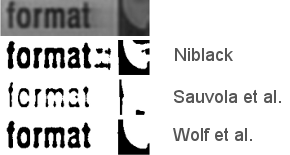

# Local Adaptive Binarization



This code uses an improved contrast maximization version of Niblack/Sauvola et al's method to binarize document images. It is also able to perform the more classical Niblack as well as Sauvola et al. methods. Details can be found in the [ICPR 2002 paper](file:///Users/chris/www/prof/publications/index.html#icpr2002v).


    You need to cite the following paper when you use this code :

    Christian Wolf, Jean-Michel Jolion and Francoise Chassaing. 
    Text Localization, Enhancement and Binarization in Multimedia Documents. 
    International Conference on Pattern Recognition (ICPR), 
    volume 4, pages 1037-1040, 2002. 

## Usage:

```
Usage: ./binarizewolfjolion [ -x <winx> -y <winy> -k <parameter> -m <method> ] <inputimage> <outputimage>

method: n           Niblack (1986)         needs white text on black background
        s           Sauvola et al. (1997)  needs black text on white background
        w (deafult) Wolf et al. (2001)     needs black text on white background

Example:
       ./binarizewolfjolion -m w in.pgm out.pgm
       ./binarizewolfjolion in.pgm out.pgm
       ./binarizewolfjolion -m s -x 50 -y 50 -k 0.6 in.pgm out.pgm
```

The best working method is 'w', the one which performed 5th in the [DIBCO 2009 competition](http://www.cvc.uab.es/icdar2009/papers/3725b375.pdf).

If no further arguments are provided, than the window sizes are estimated automatically. The argument -k sets the "k" parameter from all 3 papers. 

> IMPORTANT! Note, that the parameter should be set differently according! It might be necessary to set a different parameter for Niblack's method (he recommends -0.2 in his paper). 

## Compilation

The code has been developed under Linux. No project files are provided for Windows, although the code should in principle compile under Windows.

## Credits

This code was written by [Christian Wolf](http://liris.cnrs.fr/christian.wolf/). 

Patched by Thibault Yohan for faster speed (uses open-cv integral images.)

## GIMP/Python version

A GIMP Plugin written in Python has been written by Vincent Vansuyt (thanks!). He provides the plugin upon 
request : http://www.vvpix.com.

## Licence

Permission is granted for anyone to copy, use, modify, or distribute this program and accompanying programs and documents for any purpose, provided this copyright notice is retained and prominently displayed, along with a note saying that the original programs are available from my web page.

The programs and documents are distributed without any warranty, express or implied. As the programs were written for research purposes only, they have not been tested to the degree that would be advisable in any important application.

All use of these programs is entirely at the user's own risk.

    You need to cite the following paper when you use this code :

    Christian Wolf, Jean-Michel Jolion and Francoise Chassaing. 
    Text Localization, Enhancement and Binarization in Multimedia Documents. 
    International Conference on Pattern Recognition (ICPR), 
    volume 4, pages 1037-1040, 2002. 


